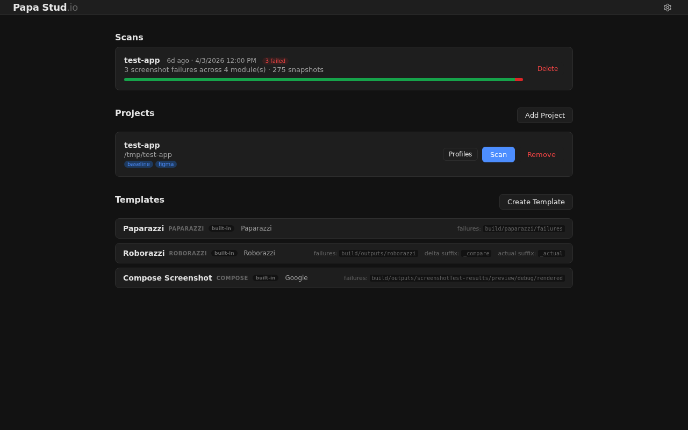
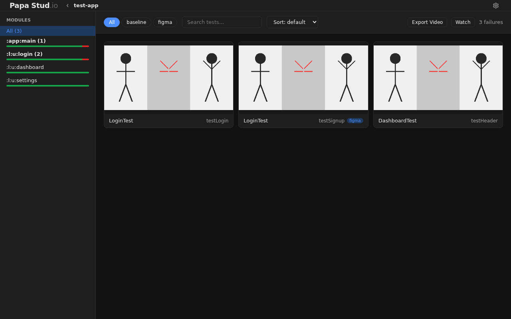
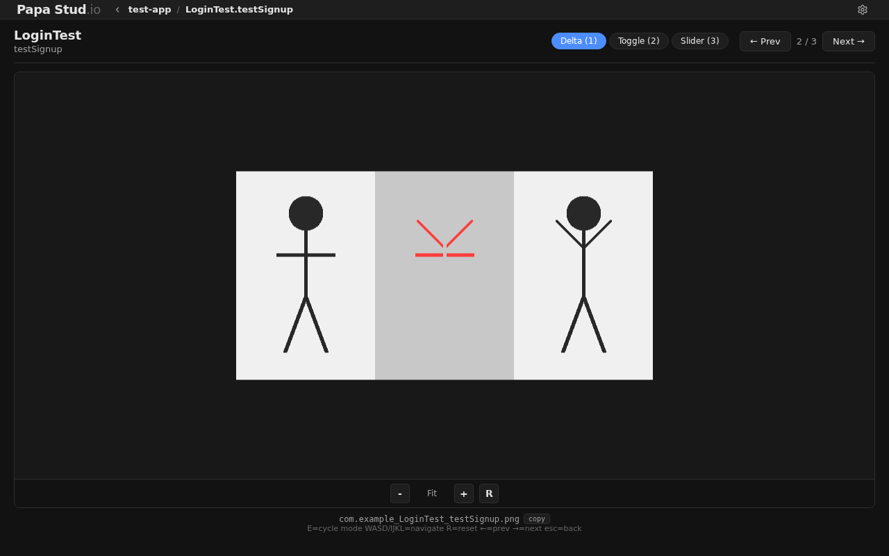

# Papa Stud.io

Screenshot failure reviewer for Android testing tools (Paparazzi, Roborazzi, Compose Screenshot Testing).

Scans your Gradle project for screenshot test failures, shows delta/golden/actual images side-by-side with diff percentages, and lets you review them in a clean UI.





## Install

```
brew tap eboudrant/tap
brew install --cask papastud
```

## Run from source

```bash
git clone https://github.com/eboudrant/papa-stud.git
cd papa-stud
npm install
npm start        # http://localhost:8770
npm run electron # desktop app
```

## Features

- Supports **Paparazzi**, **Roborazzi**, and **Compose Screenshot Testing** out of the box
- Custom profile templates for any screenshot testing tool
- Delta / Toggle / Slider comparison modes with zoom and pan
- Multi-module Gradle project scanning
- Real-time file watching (re-scans on test re-run)
- Video export of failures (requires ffmpeg)
- Config import / export
- Dark / light / system theme
- Desktop app (Electron) or run from source

## Testing

```bash
# Unit tests
npm test

# Screenshot tests (Docker)
docker build -f Dockerfile.test -t papastud-test .
docker run --rm -e CI=true papastud-test npx playwright test

# Update baselines
docker run --rm -v ./tests/screenshots:/app/tests/screenshots papastud-test npx playwright test --update-snapshots
```

## Project structure

```
electron/          Electron shell (main process, preload, menu)
src/               Express server (routes, scanner, templates, watcher)
static/            Frontend (HTML, CSS, JS — no build step)
data/              Runtime data (projects, templates, scans)
tests/             Unit tests + Playwright screenshot tests
```

## License

MIT
